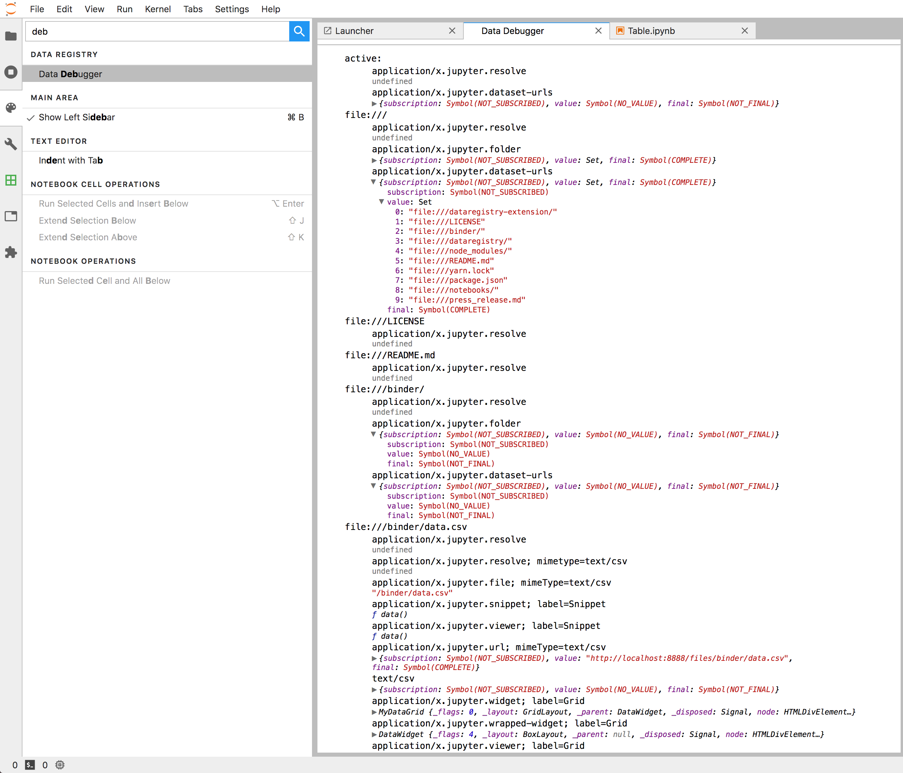

# JupyterLab Data Explorer

 [](https://mybinder.org/v2/gh/jupyterlab/jupyterlab-data-explorer/a4ae231f6e1c52b5aee1dd7fad4985722d863456?urlpath=lab/tree/notebooks/Table.ipynb) [](https://www.npmjs.com/package/@jupyterlab/dataregistry-extension) [](https://www.npmjs.com/package/@jupyterlab/dataregistry)

```bash
jupyter labextension install @jupyterlab/dataregistry-extension
```

* Bring any data type you can imagine! **Extensible** and **type safe** data registry system.
* Register **conversions** between the different data types.
* Data changing on you? Use [`RxJS` **observables**](https://rxjs.dev/) to represent data over time.
* Have a new way to look at your data? Create **React** or **Phosphor** components to view a certain type.
* Built in data **explorer UI** to find and use available datasets.
* Dataset in your dataset? Use the **nested** datatype.
* Building another data centric application? Use the **`@jupyterlab/dataregistry`** package which has no JupyterLab dependencies.
* Check out the project vision in the ["Press Release from the Future"](./press_release.md)!


## I want to...

### Explore my data in JupyterLab:

1. Install JupyterLab >= 1.0
2. `jupyter labextension install @jupyterlab/dataregistry-extension`
3. Browse available datasets in the data explorer left side pane. We include support for viewing a few datasets. We plan on expanding this list and third party extension can extend it:
   1. Opening CSV files in the data grid and adding a snippet to open them with Pandas
   2. Opening PNG images in an image viewer
   3. Opening table data outputted in a notebook with [`nteract`'s data explorer](https://github.com/nteract/nteract/tree/master/packages/data-explorer)


### Support a new data type or conversion:

You can either add support in this repo or by creating a new JupyterLab extension that depends on the `IRegistry` exposed by this extension. You can access a `Registry`, which you can use to add your own converter. 

It might also be useful to view the existing data types by looking at the source code in this repo and by using the debugger. You can open this in JupyterLab by looking for the "Data Debugger" command:



### Develop on this repo:

```bash
git clone https://github.com/jupyterlab/jupyterlab-data-explorer.git
cd jupyterlab-data-explorer

// (optional) Create a fresh conda environment
// conda create -n jupyterlab-data-explorer -c conda-forge python=3.6
// conda activate jupyterlab-data-explorer

// Install Jupyterlab
pip install jupyterlab

// Build and link the data explorer packages
jlpm build:dev

// Run Jupyterlab
jupyter lab
```

## Contributing

This repo is in active development, and we welcome any collaboration. If you have ideas or questions, feel free to open an issue. From there, we could setup a call to chat more in depth about how to work together. Please don't hesitate to reach out.

Or, feel free to tackle an existing issue or contribute a PR that you think improves things. We try to keep the current issues relevant and matched to relevant milestones to give a sense on where this is going.

If the community grows around this, we can adopt a more regular public meeting.
